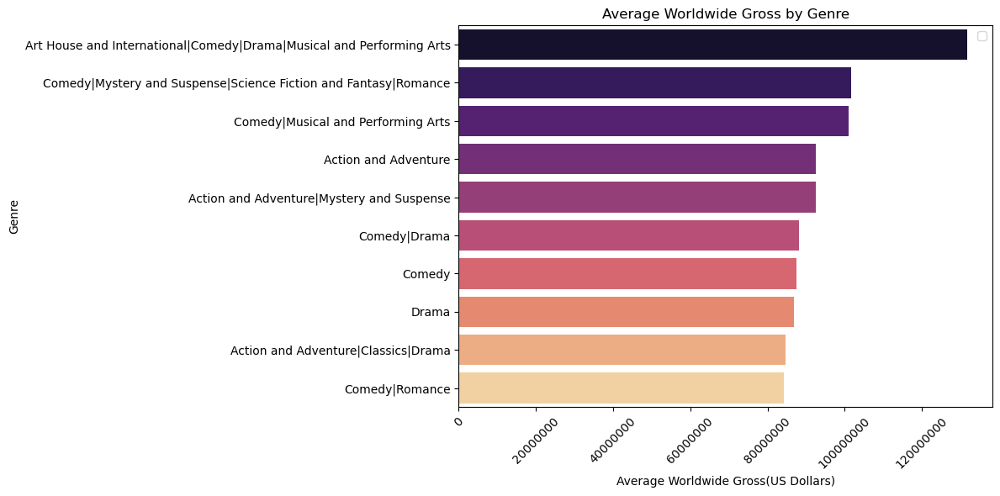
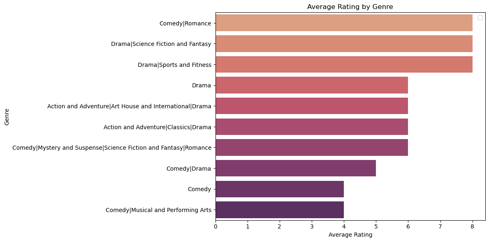
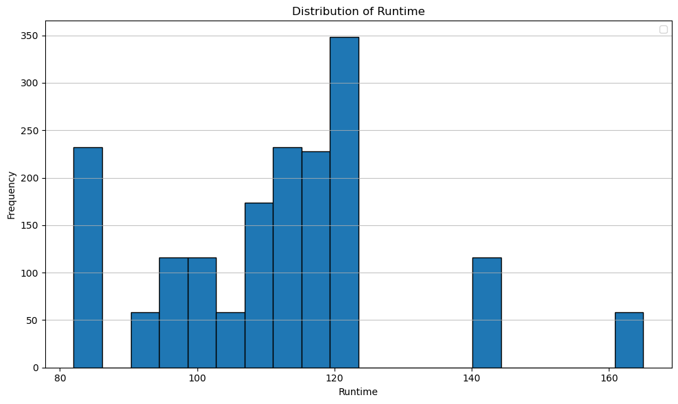
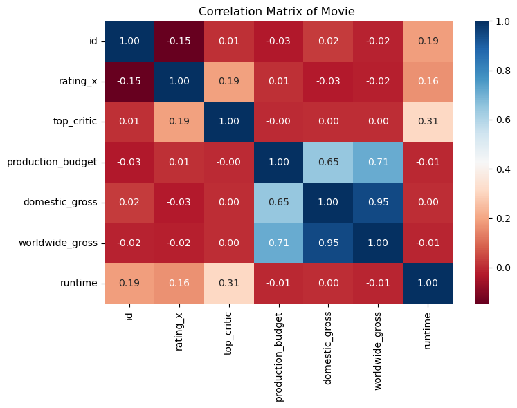

# Phase-2-Project-Movie-Data

# Wakanda-Movie-Studios – Entering the Movie Industry

**Author**: [Edwin Korir](https://github.com/Edwinkorir38)

## Overview
This project explores and analyses movie data from different sources to generate insights on trends, rating, audience reception, correlations and perfomances for a business stakeholder. The Wakanda Movie Studio can use this analysis to decide on the best approach on producing, marketing and managing movies.
 
## Business Problem
Our company now sees all the big companies creating original video content and they want to get in on the fun. They have decided to create a new movie studio, but they don’t know anything about creating movies. We are charged with exploring what types of films are currently doing the best at the box office. We must then translate those findings into actionable insights that the stakeholder (Wakanda Movie Studios) can use to help decide what type of films to create.

## Key Business Questions and Objectives

* What is the most profitable movie genre

* What is the ideal production budget to produce a successful movie

* Which type of movie has the highest ratings

* Does the movie runtime influence the success of a movie

## Data Understanding

### Data Source
Dataset was obtained from various locations;

* [Tomatoes](https://www.rottentomatoes.com/)

* [IMDB](https://www.imdb.com/)

* [TheMovieDB](https://www.themoviedb.org/)

* [Box Office Mojo](https://www.boxofficemojo.com/)

* [The Numbers Rotten](https://www.the-numbers.com/)

Different files had different formats: compressed CSV (comma-separated values) or TSV(tab-separated values) files and contains information of over 30,000 movies.Data was organized into several tables and several columns containing different information about the movies such as;The movie title, production budget, genre,runtime, and each movie having a unique ID.

Challenges encountered during data preparation included; missing values, outliers and placeholders.Data sets with Unique primary IDs were merged for ease of understanding and use.

## Results

* Revenue (Domestic & Worldwide);High variation in std indicating possible outliers showing movies perform differently with a Domestic Gross Mean of $40.7M and Worldwide Gross Mean of $87.7M

* Runtime; Movie runtime had a mean of 112 min with 75% of the movies recording runtime of less than 120 min 
minutes

Summary statistics suggests most of the data is within range with few outliers in revenue and runtime that did not affect the data

### Objective 1: Most profitable movie genre

 
In the worldwide scene, Art House and international and Comedy/Musical and performing Arts generated the most revenue while  Drama generated the least followed by action and Adventure and Comedy/romance.

### Objective 2: ideal Production Budget to use

The graph suggests a positive relationship between production budgets and world wide gross hence the higher the production budget the higher the worldwide gross.

### Objective 3: Highest ratings

Most movies had average ratings with best rated genre being comedy/Romance ,drama/science fiction and fantasy and drama/sports and fitness while Least rated genre included comedy and comedy/musical and performing Arts.Drama and action/adventures were moderately rated

### Objective 4: Optimal runtime for movie success

Seventy Five (75%) of the movies had a runtime of less than 120 minutes with 350 of the movies analyzed had a runtime of 120 minutes.Generally most movies averaged between 100 -120 minutes runtime.Some outliers were present with runtime of 80 and 160 minutes but did not affect the data.

## Correlation matrix of Movie variables

* Strong positive correlation between domestic gross and worldwide gross  indicates successful movies domestically are also successful globally

* Strong positive correlation between production budget and worldwide gross  indicates higher production budgets leads to higher revenue

* Weak negative correlation between rating and domestic and worldwide gross indicates that ratings don't strongly predict revenue

* Runtime has a weak correlation with worldwide and domestic gross showing that Movie length doesn’t impact revenue generation

* Runtime & Ratings have moderate positive correlations suggesting that Longer movies might receive better reviews

## Conclusions

**This analysis yielded the following conclusions:**

* Drama Genre has highest views and ratings however,it also has the lowest revenue gross

* Combined movie genre require less production budgets than single genres

* Art House and international and Comedy/Musical had highest worldwide and domestic gross

* The higher the Domestic gross the higher the worldwide gross

* The higher the production budgets the higher both gross domestic and worldwide

* Optimal movie runtime is < 120 minutes

## Recommendations

**We recommend  that Wakanda Movies Studios to adopt the following recommendations for a succesful entry into the movie industry** 

* Produce movies from drama/ comedy/action/adventure genre for better success, increase tickets costs for higher revenue gross and reduce movie piracy in this genres after production

* Focus on production of Combined genres,specifically combined genre with highest views such as Comedy/Drama/Adventure

* Produce Art House and international comedy/drama and Musical and preforming arts for higher revenue

* Invest in adequate marketing and movie promotion locally i.e. movie premiers and trailers to maximize its success in the global scene

* Allocate higher budgets to movie production while factoring in other aspects like genres, runtime and ratings for higher revenue

* Focus on Movies with a runtime of 100 -120 minutes

## Next Steps

**Further analysis to improve prediction:*** 

* Stay up to date with real time industry data and adjust to new concepts and ideas coming out

* Further research on movie data using other methodology's i.e qualitative data seeking opinions and observations from movie fans and industry professionals (Focus Group Discussions and key informant interviews)

## For more information

Please review our full analysis in [our Jupyter Notebook](student.ipynb) or our [presentation](Presentation.pdf).

For any additional questions, please contact **[Edwin Korir](https://www.linkedin.com/in/edwin-korir-90a794382)

